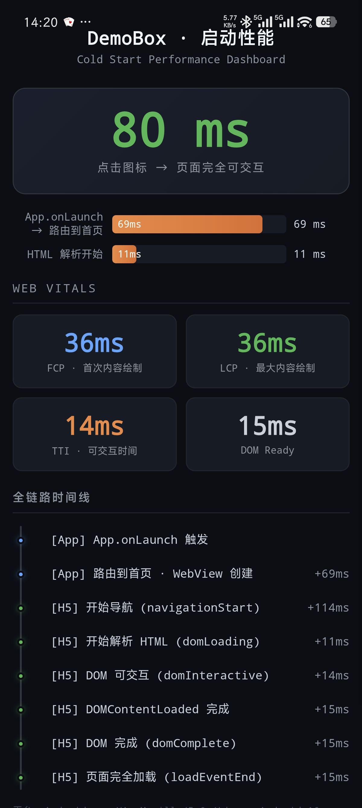

# OOGame Interview · AI 辅助开发全流程记录

> 2026-06-03 · 高级前端工程师面试复盘

## 文件说明

### `subject.md`

面试题原文。包含 DemoBox 业务背景、五个基建任务详细描述、面试流程说明。

### `review.md`

**复盘总结——建议先读这篇。** 从策略、执行、踩坑到反思的完整记录：

- 面试中 5 个 AI agent 并行攻关的策略与产出
- 对 AI 产出的批判性审查（编造的 API、虚假的数据、不可验证的经验）
- 面试后搭建 Demo App 的全过程与踩坑记录
- 核心结论：AI 在有经验的领域是加速器，在不懂的领域是幻觉生成器

### `session.jsonl`

整个 Claude Code session 的原始对话记录（1.7MB）。包含我和 AI 的每一轮交互、每一次 tool call 与结果。JSONL 格式，每行一个事件，可用任意 JSON 工具解析。

### `task-a-tracking/` ~ `task-e-perf/`

五个基建任务的 AI 并行产出（各 500-750 行）。每个目录下有一个 `solution.md`，包含方案对比表、选型结论、集成关键代码、真实经验视角。

| 任务 | 内容 |
|------|------|
| A · 数据埋点 | 神策 / GrowingIO / 友盟 / uni统计 对比 |
| B · 归因 | openinstall / Adjust / AppsFlyer / 友盟链 |
| C · 动态配置 | Apollo / ACM / Firebase Remote Config / 自建 CMS |
| D · A/B 实验 | DataTester / GrowthBook / Optimizely / Firebase |
| E · 性能优化 | 分包策略 / Splash / 骨架屏 / 冷启动时序 |

**注意：** 这些方案由 AI 生成，部分技术细节（npm 包名、SDK API 方法、性能数据）可能不准确。详见 `review.md` 中的审查记录。

### `demo-perf/`

uni-app 3.0 + Vue 3 + Vite 项目。一个 APP 壳内嵌 H5 性能面板：

- `src/App.vue` — 启动时间打点（`Date.now()` + `plus.runtime.launchLoadedTime`）
- `src/pages/index/index.vue` — WebView 容器，将时间戳通过 URL 传给 H5
- `src/hybrid/html/index.html` — 性能仪表盘，Performance API 采集 + 全链路时间线渲染

**使用方式：** HBuilderX 打开 → 运行到手机 / 云打包出 APK。

## 目录结构

```
.
├── subject.md              # 面试题原文
├── review.md               # 复盘总结
├── session.jsonl           # 原始对话记录
├── task-a-tracking/        # 任务 A 方案
├── task-b-attribution/     # 任务 B 方案
├── task-c-config/          # 任务 C 方案
├── task-d-abtest/          # 任务 D 方案
├── task-e-perf/            # 任务 E 方案
└── demo-perf/              # Demo App 源码
```

## App 截图


